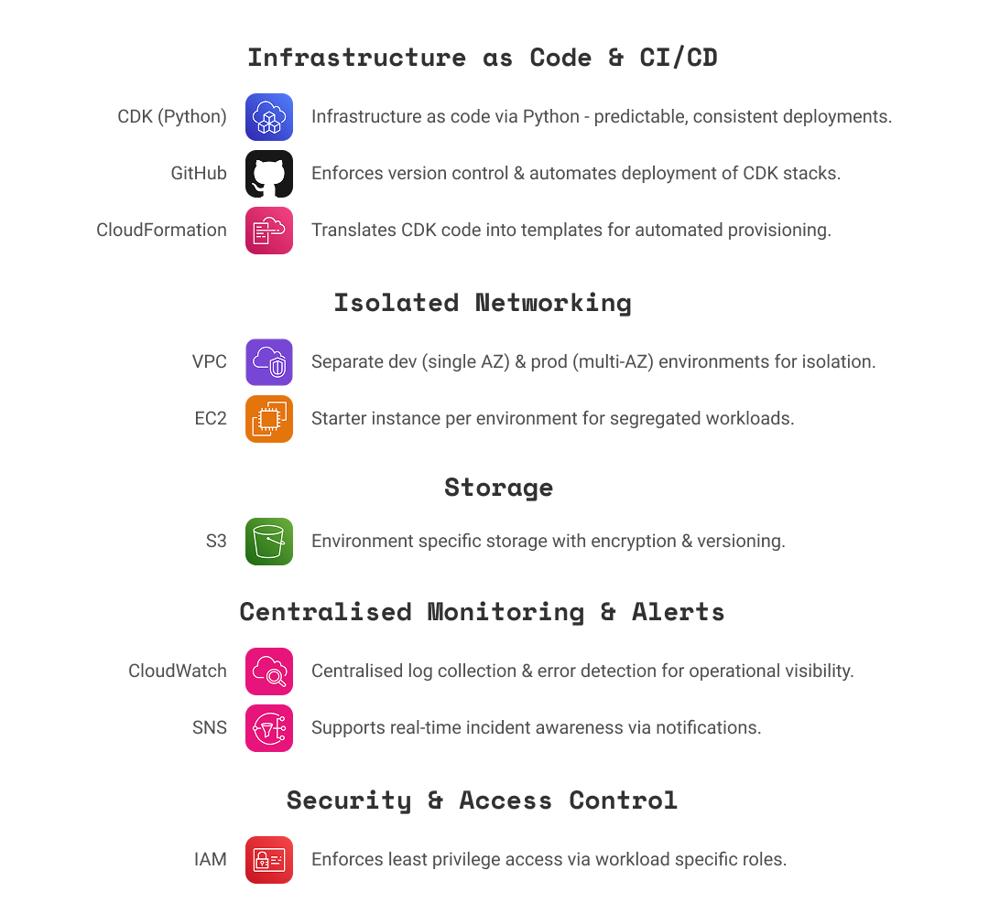

# Landing Zone Infrastructure as Code using AWS CDK & CloudFormation + CI/CD #

A compact demonstration of Infrastructure as Code (IaC) using the AWS Cloud Development Kit (CDK) in Python.  
This repo simulates a simplified Landing Zone with isolated Dev and Prod environments, secure IAM patterns, and an automated CI/CD pipeline.

---
 
## Overview

This project demonstrates how to design and deploy a small, secure, multi-environment AWS foundation using CDK:

- Environment isolation (Dev vs Prod)  
- VPC and networking patterns (single-AZ Dev, multi-AZ Prod)  
- Least-privilege IAM roles and separation of duties  
- Reusable stack composition and patterns in Python CDK  
- Automated deployment via GitHub Actions (CI/CD)

---
 
## Architecture

Overview Diagram:

**Stacks:**

- **Core Stack** - shared services/observability (CloudWatch, SNS alarms, S3 buckets)  
- **Network Stack** - VPCs, subnets, IGW, NAT Gateways  
- **Dev Stack** - development environment (single AZ, smaller footprint)  
- **Prod Stack** - production environment (multi-AZ for availability)

**Networking summary:**

- **Dev VPC:** 1 public subnet + 1 private subnet in a single AZ  
- **Prod VPC:** 2 public subnets + 2 private subnets across 2 AZs  
- **Internet Gateway (IGW):** attached to VPC for public subnet internet access  
- **NAT Gateway:** placed in public subnet(s) to allow private subnet egress  

**Security & IAM:**

- CDK-created IAM roles scoped per environment  
- CI/CD deploy role + least-privilege deployer profiles 
- Resource tagging by environment for governance

Detailed Diagram:

---
 
## CI/CD (GitHub Actions)

The workflow (`.github/workflows/cdk-deploy.yml`) contains:

1. Checkout repository  
2. Set up Python (virtualenv) and Node (for CDK CLI)  
3. Install `pip` requirements and `npm` CDK if needed  
4. `cdk synth` to validate/synthesize CloudFormation templates  
5. `cdk deploy` to deploy stacks 

**Note:** For safer prod deployments, require manual approval or use a separate GitHub environment with required reviewers.

---
 
## Deployment:

1. Adjust [cdk-deploy.yml](.github/workflows/cdk-deploy.yml) environment variables accordingly.
2. Add your AWS_ACCOUNT_ID as a GitHub Actions secret. This is required for the CI/CD workflow to run.
3. Adjust [app.py](app.py) variables section accordingly.
4. Follow below notes for best practices:

Roles are currenty assumed by AccountRootPrincipal(). For production, consider: 
- Assigning the roles to specific IAM users, groups, or SSO roles.
- Narrowing 'DevOpsRole' (in [core_stack.py](stacks\core_stack.py)) service permissions as it currently uses service wildcards for demo purposes.

Prod S3 Bucket removal policy currently set to DESTROY. For production, consider:
- Adjusting Prod S3 Bucket removal policy (in [prod_stack.py](stacks/prod_stack.py)) to RETAIN.

CloudWatch Logs removal policy currently set to DESTROY. For production, consider:
- Adjusting CloudWatch Logs removal policy (in [core_stack.py](stacks/core_stack.py)) to RETAIN.

